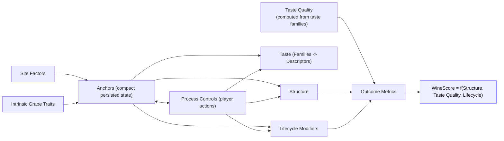

# Wine System Variable Relationship Map (Rewritten)
Date: 2026-05-20  
Status: Architecture mapping plus current taste-quality implementation notes

## 1) Purpose
This document is the updated target map for the wine simulation architecture.

Primary goals:
- Make terminology clear and consistent.
- Reduce persisted anchor complexity.
- Keep taste as its own model (families + descriptors), with a computed taste-quality signal feeding wine score.
- Remove legacy naming and fallback behavior.
- Remap contract "quality" away from taste index.

## 2) Updated Terminology

| Term | Meaning | Examples |
|---|---|---|
| Site Factors | Vineyard and region context that exists before player processing choices | `country`, `region`, `soil`, `altitude`, `aspect`, `landValue`, `density`, `overgrowth`, `vineAge`, `vineyardHealth`, `ripeness` |
| Intrinsic Grape Traits | Grape-inherent properties with direct gameplay effects | `grapeColor`, `naturalYield`, `fragile`, `proneToOxidation`, base structure constants |
| Anchors | Persisted hidden wine identity state; should be compact and multi-source | Proposed 12-key anchor model below |
| Process Controls | Player actions in winery and vineyard operations | crush method/options, fermentation method/temperature, harvest timing choices |
| Structure Layer | Player-facing structural channels and structure index | `acidity`, `aroma`, `body`, `spice`, `sweetness`, `tannins`, `structureIndex` |
| Taste Layer | Flavor-family and descriptor model used for taste wheel/web and taste quality | 14 families, descriptors grouped under families |
| Lifecycle Modifiers | Ongoing evolving systems after creation | feature severities, bottle aging, prestige effects |
| Outcome Metrics | Economy and progression outputs | wine score, price, contracts, highscores, achievements |
| Snapshot | Immutable historical capture at event boundaries | harvest snapshot, bottling snapshot, winelog snapshot |

## 3) Correction: "Metadata" vs System Drivers
`grapeColor`, `naturalYield`, `fragile`, `proneToOxidation` are not passive metadata.

They are first-class drivers:
- `grapeColor`: impacts structure/taste pathways and family balance.
- `naturalYield`: directly impacts harvest output and economy.
- `fragile`: affects risk and process sensitivity.
- `proneToOxidation`: directly feeds risk/features and lifecycle behavior.

These belong in `Intrinsic Grape Traits` and should be treated as direct inputs in dependency maps.

## 4) Proposed Anchor Reduction (26 -> 12 persisted keys)

### 4.1 Persist only stateful, multi-source anchors
Proposed persisted anchors:
1. `sugarPotential`
2. `acidPotential`
3. `phenolicPotential`
4. `aromaticPotential`
5. `bodyPotential`
6. `extractionState`
7. `fermentationState`
8. `leesState`
9. `oxidationPressure`
10. `maturationState`
11. `terroirExpression`
12. `processFootprint`

### 4.2 Existing -> Target anchor consolidation
| Current anchor key | Target |
|---|---|
| `residualSugar`, `harvestTiming` | `sugarPotential` |
| `juiceAcidity` | `acidPotential` |
| `phenolicExtract`, `colorIntensity`, part of `skinContactEvolution` | `phenolicPotential` |
| `aromaticIntensity`, part of `varietyCharacter` | `aromaticPotential` |
| `textureRichness`, `alcoholPotential` | `bodyPotential` |
| `crushingExtraction` | `extractionState` |
| `fermentationProfile` | `fermentationState` |
| `leesContact` | `leesState` |
| `oxidativeCharacter` | `oxidationPressure` |
| `cellarEvolution` | `maturationState` |
| `regionalTypicity`, `soilAffinity`, `solarClimateFit`, `microclimateBlend`, `siteAltitude`, `aspectWarmth`, `vineAgeCharacter`, `rowCompetition`, `siteWildness`, `vineyardHealth` | `terroirExpression` |
| `featureFootprint` | `processFootprint` |

### 4.3 Context values that should be computed, not persisted as anchors
Examples:
- `soilAffinity` (from site and suitability calculations)
- `aspectWarmth`
- `siteAltitude`
- `rowCompetition`
- `microclimateBlend`

These should be regenerated from current state and used as inputs into compact anchors, not stored as separate long-lived anchor keys.

## 5) Taste Model Shape

### 5.1 Keep
- 14 flavor families as core taste model.

### 5.2 Change
- Descriptors must be children of families (hierarchical model), not a parallel flat set.
- Taste metrics (`intensity`, `complexity`, `harmony`, `typicity`, `layerBalance`, `flavorQualityIndex`) should not be core gameplay outputs.  
  Use them only as optional debug/telemetry if retained.

### 5.3 Descriptor-family grouping (target)
| Family | Descriptors |
|---|---|
| `flower` | `floralLift`, `whiteFloral` |
| `citrus` | `citrusZest`, `grapefruit`, `orangeZest` |
| `treeFruit` | `orchardFruit`, `greenApple`, `yellowApple`, `pearNotes`, `whitePeach`, `stoneMelon` |
| `tropicalFruit` | `tropicalNotes`, `tropicalIsland` |
| `redFruit` | `redBerry` |
| `blackFruit` | `darkFruit` |
| `driedFruit` | `driedConcentrated`, `honeyed` |
| `spiceFlavor` | `pepperBakingSpice` |
| `vegetable` | `herbalGreen` |
| `earth` | `earthMineral`, `graphiteMineral` |
| `microbial` | `yeastLees` |
| `oakAging` | `oakToastVanilla` |
| `generalAging` | `bottleEvolved`, `leatheryTobacco` |
| `faults` | `faultEdge` |

## 6) New High-Level Dependency Map (Target)

## 7) Scoring/Outcome Intent
- The old fixed `qualityIndex = 0.5` placeholder has been replaced by computed taste quality.
- Wine score inputs:
  - `structureIndex`
  - `tasteQualityIndex`, computed from the 14 taste families
  - lifecycle effects as relevant modifiers
- Descriptor-level taste remains display-only for now.
- TypeScript compatibility fields may still be named `qualityIndex` while persistence maps them to `taste_quality_index`.

## 8) Contract Quality Requirement Remap

Current observed implementation:
- Contract requirement type `quality` uses `tasteIndex`.

Target behavior:
- Contract quality should use a meaningful current quality signal, not the old fixed placeholder.
- In this slice, the wine-side quality signal is `tasteQualityIndex`; site-static quality remains in the land-value/price path.

## 9) Legacy Naming Removal Policy

### 9.1 Rules
- No fallback aliases for renamed fields in business logic.
- No dual semantics in single columns.
- Use explicit names for snapshots and current values.

### 9.2 Naming direction
| Legacy | Target direction |
|---|---|
| `grape_quality` | split to explicit fields, including `taste_quality_index` for taste balance and `land_value_modifier_*` for site/static quality |
| `born_grape_quality` | explicit snapshot field (example `land_value_modifier_harvest_snapshot`) |
| `quality_index` database column | `taste_quality_index` |
| `quality_index_harvest_snapshot` database column | `taste_quality_index_harvest_snapshot` |
| `quality_index_bottling_snapshot` database column | `taste_quality_index_bottling_snapshot` |
| `balance` fallback | remove; use `structure_index` only |
| `bornTasteIndex` | `tasteIndexHarvestSnapshot` (or remove if not required by new model) |
| `bornStructureIndex` | `structureIndexHarvestSnapshot` |
| `bornLandValueModifier` | `landValueModifierHarvestSnapshot` |
| `bottledTasteIndex` | `tasteIndexBottlingSnapshot` |
| `bottledStructureIndex` | `structureIndexBottlingSnapshot` |
| `bottledWineScore` | `wineScoreBottlingSnapshot` |

## 10) Snapshot Scope Clarification
Agreed intent:
- `born*` style values should represent immutable snapshots only.
- Snapshots are primarily for historical integrity (wine log/highscore/achievement context) and should not drift due to lifecycle updates.
- Runtime current values should remain separate from snapshot values.

## 11) Relationship Matrix (Target)
| Producer | Output | Main consumers |
|---|---|---|
| Site Factors + Intrinsic Grape Traits | compact anchors | process response tuning, structure, taste, lifecycle |
| Process Controls | anchor deltas + structure/taste deltas | lifecycle and outcomes |
| Anchors + Process Controls | structure channels | structure index |
| Anchors + Process Controls | taste families/descriptors | taste UI/web |
| Structure + taste quality + lifecycle | wine score and economic outcomes | pricing, contracts, highscores, achievements |
| Snapshot capture points | immutable historical records | wine log, highscores, achievements |

## 12) Migration Guidance (Planning Only)
1. Lock terminology and target field names.
2. Define compact 12-anchor schema and mapping from current 26.
3. Move descriptor model to strict family-child hierarchy.
4. Remap contract quality from `tasteIndex` to a meaningful current wine quality signal.
5. Feed wine score from computed taste quality and structure index.
6. Remove legacy/fallback naming and migrate storage fields to `taste_quality_index*`.
7. Keep snapshots explicit and immutable.

---
This rewritten map is the agreed target architecture baseline for upcoming implementation tasks.
