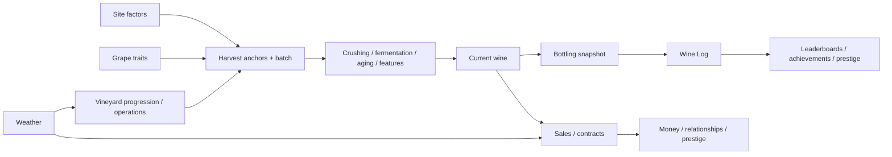
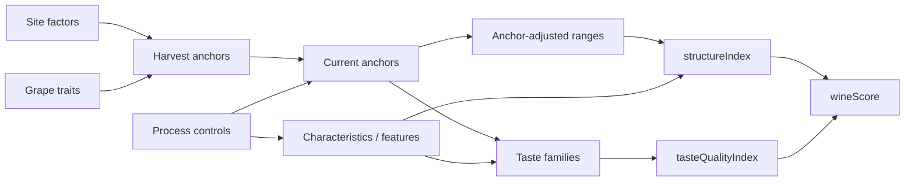
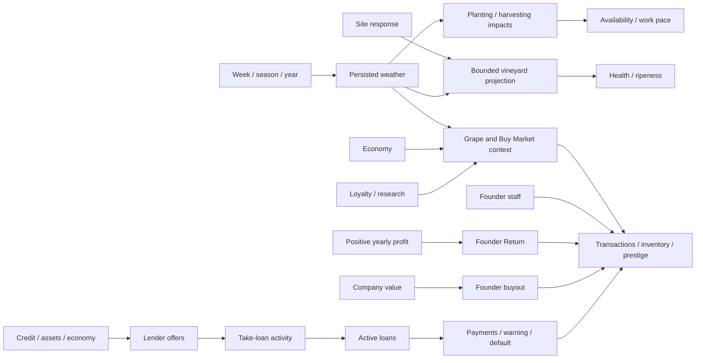

# Wine System Variable Relationship Map

Date: 2026-07-20
Status: Current mainline relationship map

Stable terminology and rules live in [CONTEXT.md](../CONTEXT.md). Code ownership is in [PROJECT_INFO.md](PROJECT_INFO.md); current implementation status is in [AIDescriptions_coregame.md](AIdocs/AIDescriptions_coregame.md).

## Reading rules

- Arrows show data dependency, not call order.
- Harvest and bottling/Wine Log snapshots are immutable; cellar values may continue to evolve.
- `landValueModifier`, `tasteQualityIndex`, and `structureIndex` are separate signals.

## Main gameflow

## Variable groups

| Group | Main inputs | Main consumers |
|---|---|---|
| Site | Region, soil, altitude, aspect, land value, vines, health | Suitability, anchors, vineyard projection, contracts |
| Grape | Variety constants, color, yield, fragility, oxidation risk | Characteristics, yield, anchor bias, markets |
| Anchors | Site, grape, process, features | Structure ranges, taste profile, lifecycle risk |
| Structure | Characteristics and anchor-adjusted ranges | `structureIndex`, contracts, score |
| Taste | Anchors, characteristics, color, features, aging | Families, descriptors, `tasteQualityIndex`, score |
| Lifecycle | Features, oxidation, aging, prestige | Current taste, price, cellar value, risks |
| Weather | Weekly state/forecast, site response, economy | Health/ripeness, operation work, market context |
| Markets | Wine/grape state, economy, weather, loyalty, research | Normalized Buy Market offers, global/local sources, orders, contracts, prices, revenue |
| Storage | Vessels, allocations, maintenance activities | Capacity, batch volume, equipment and market assets |
| Progression | Scores, sales, assets, research | Prestige, achievements, leaderboards, gates |

## Wine calculation flow

Price consumes wine score, score curve, land value, features, company prestige, and vineyard prestige. Current wine feeds sales and cellar value; bottling snapshots feed historical records.

## Weather, markets, and finance flow

## Cross-domain invariants

- Structure measures physical balance; Taste Quality measures family balance; neither is land value.
- Weather uses an explicit bounded projection and does not enter wine-score formulas or historical snapshots as a hidden side effect.
- Winter blocks starting planting; severe conditions slow planting/harvesting work and extreme conditions can pause it. Clearing's annual availability is a vineyard rule.
- Buy Market previews are side-effect-free. Each offer has one seller/source and buyer-to-seller relationship pricing; adapters retain their own stock, evolution, and base-price rules.
- Storage Vessels are canonical assets. Supplier purchases create company-owned assets; used-market purchases transfer a globally listed asset with identity and history intact. Wine contact marks a vessel dirty, but cleanliness is warning-only; Empty Vessel changes only the selected filled volume and Clean Vessel is a separate cancellable activity.
- Research changes access, scaling, or explicit upstream inputs; it does not bypass structure/taste computation. `unlocks` and `permanentEffects` are authoritative over descriptive benefit copy.
- Prestige writes carry explicit source and decay metadata. Staff work has one category-derived primary skill; role/task/grape bonuses are additive and capped at 50%, and XP comes only from persisted applied work.

## Contract and snapshot relationships

| Requirement or snapshot | Source | Consumer |
|---|---|---|
| `tasteQuality` | Current `tasteQualityIndex` | Contract validation |
| `structureIndex` | Current structure score | Contract validation |
| Land value, origin, altitude, aspect | Vineyard/site | Contracts and pricing |
| Grape and color | Batch identity | Contracts, customers, markets |
| Characteristic thresholds | Current characteristics | Contract validation |
| Harvest snapshot | Site, structure, taste | Batch history and debugging |
| Bottling snapshot | Taste, structure, land value, wine score | Wine Log, leaderboards, achievements |

## UI relationship surfaces

| Surface | Primary relationship shown |
|---|---|
| Wine modal / Structure and Taste tabs | Current score, price, characteristics, ranges, families, descriptors, snapshot comparison |
| Vineyard and Weather Center | Site inputs, forecast, health/ripeness, operation status and work impact |
| Research page | Progression chains, gates, permanent effects, project state |
| Market modals | Offers, sellers, price/limit factors, loyalty, economy/weather context, projected asset state |
| Founder Panel and Finance | Founders, returns, buyout, cash flow, loans and payment state |
| Wine Log and Leaderboards | Immutable bottling history, rankings, and progression outputs |

## Current checkpoints

| Area | Relationship to preserve |
|---|---|
| Anchors | Compact persisted anchor set with strict database parsing |
| Score | `wineScore = (tasteQualityIndex + structureIndex) / 2` |
| Weather | One bounded site-aware projection plus explicit operation impacts |
| Markets | Sell-side grape trading remains separate from registered Buy Market adapters |
| Research | Gates cover grapes, fermentation, staff/vineyard caps, contracts, and buyer progression |
| Ownership | Founder economy is active; public-company/share runtime is inactive |

Update this map when a new cross-domain dependency or player-visible flow is introduced; keep isolated implementation details in the owning feature/service documentation.
