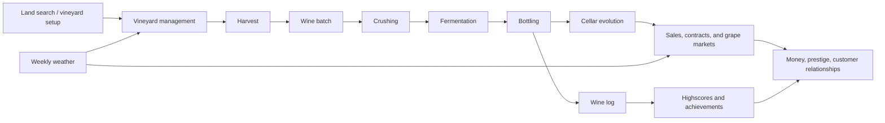
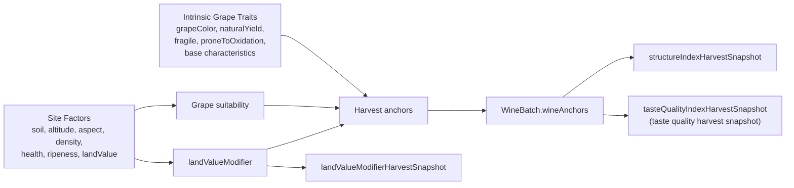
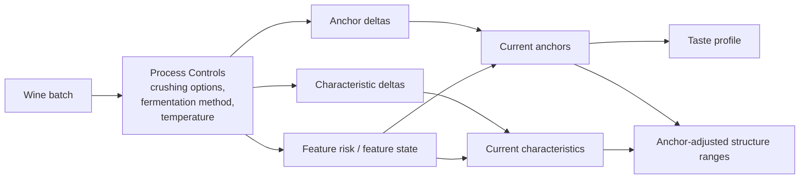
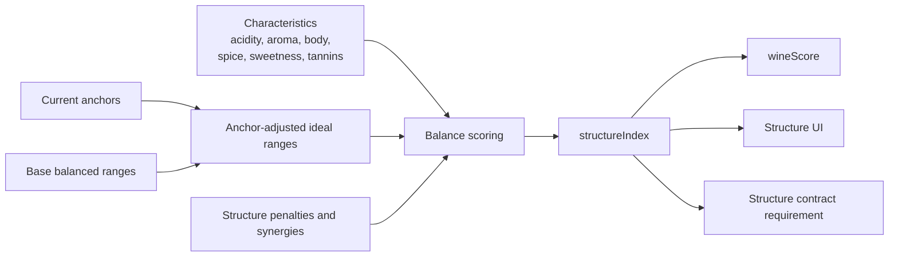
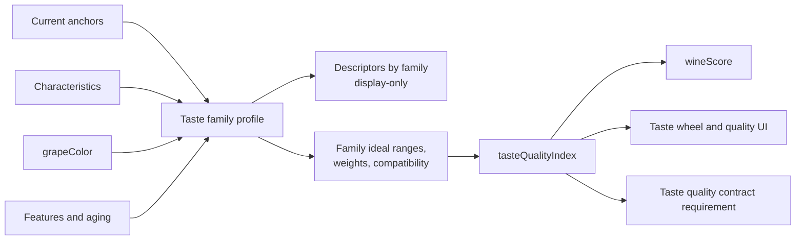
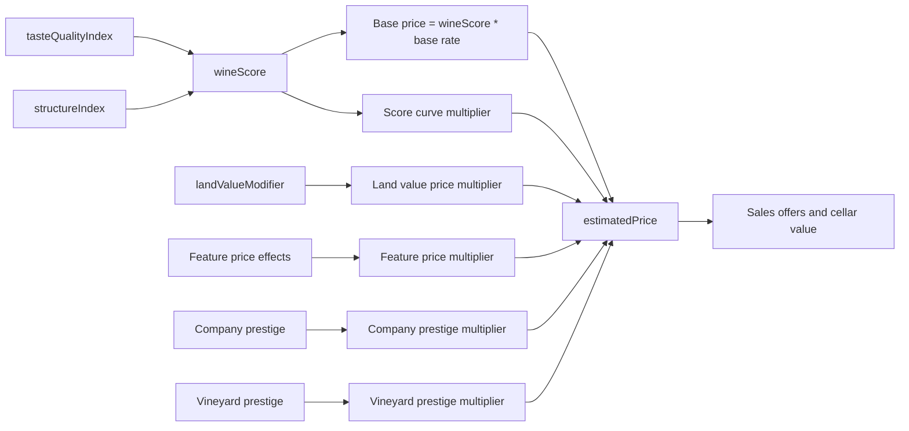
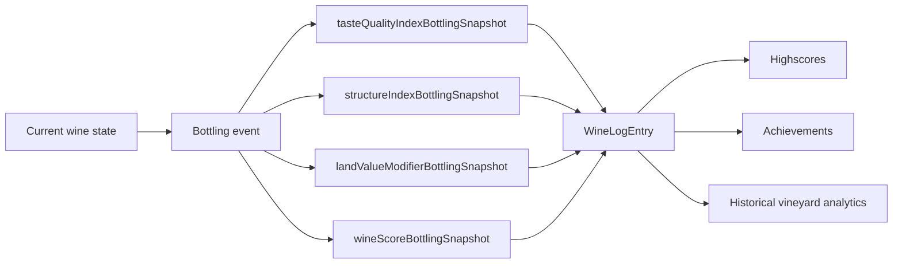
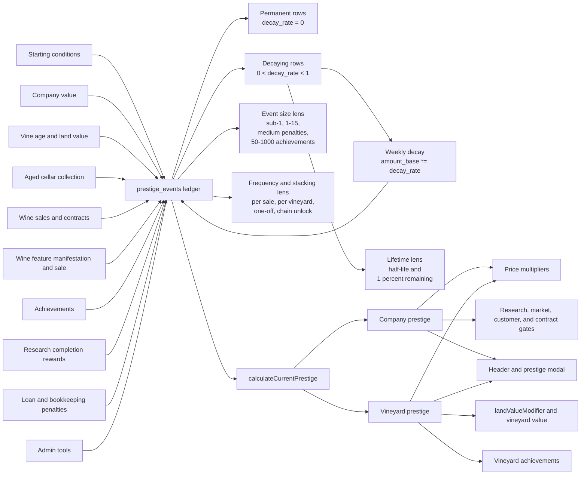
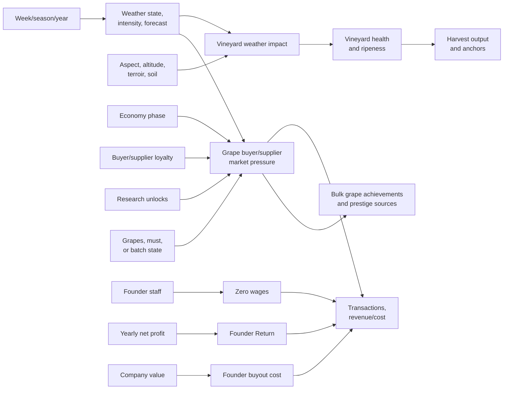
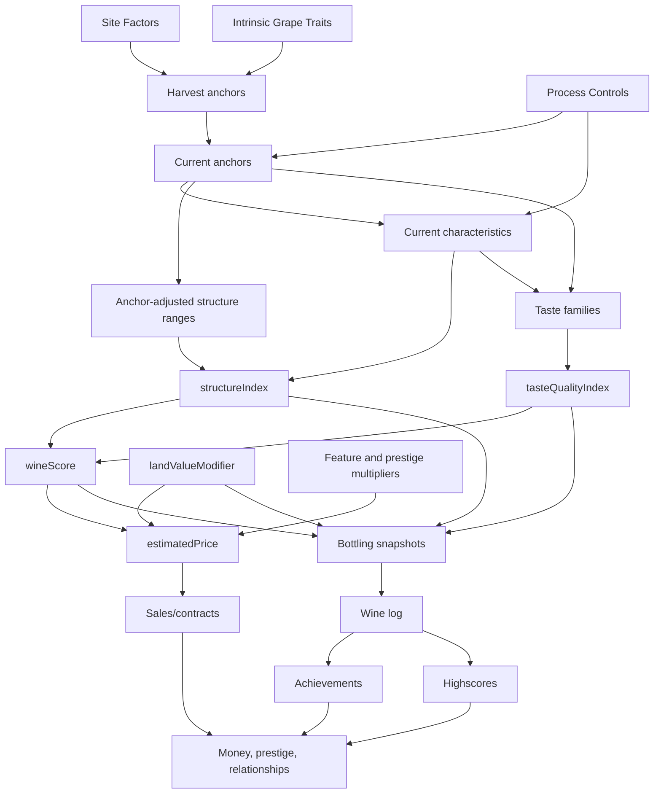

# Wine System Variable Relationship Map
Date: 2026-05-20
Status: Current variable relationship map

Stable terminology, constants, parameters, and variable descriptions live in [CONTEXT.md](../CONTEXT.md). This document focuses on how the main wine-system variables depend on each other through the gameflow.

Prestige event creators are inventoried separately in [PrestigeEventSourceInventory.md](superpowers/completed/PrestigeEventSourceInventory.md).

## 1) Purpose

This map answers three questions:

- Which variables are produced at each stage of wine gameplay?
- Which variables are snapshots, and which continue to change?
- Which subsystems consume each variable later for UI, economy, contracts, highscores, and achievements?
- Which global progression overlays, such as weather, research, prestige, and founder economy, feed into wine and market outcomes?

## 2) Reading Rules

- Arrows mean data dependency, not call order.
- Snapshot nodes are frozen values copied from current state at harvest, bottling, or winelog insertion.
- `landValueModifier` and `tasteQualityIndex` are separate signals and should not be treated as aliases.

## 3) Top-Level Gameflow

## 4) Main Variable Groups

| Group | Produced from | Produces |
|---|---|---|
| Site Factors | Vineyard generation and vineyard state | Land value modifier, suitability, harvest anchors |
| Intrinsic Grape Traits | Grape constants | Base characteristics, yield, risk sensitivity, anchor bias |
| Anchors | Site factors, grape traits, process controls, features | Structure ranges, taste profile, lifecycle risk |
| Structure Layer | Characteristics plus anchor-adjusted ideal ranges | `structureIndex` |
| Taste Layer | Anchors, characteristics, grape color, features, aging | Taste families, descriptors, `tasteQualityIndex` |
| Lifecycle Modifiers | Features, bottle aging, oxidation, prestige | Current taste, price, cellar value, risk |
| Weather Layer | Weekly weather state, intensity, forecast, season, site response | Vineyard health/ripeness deviations, grape market pressure, Weather Center rows |
| Market Layer | Wine variables, grapes/must, economy phase, weather, relationships, research | Orders, contracts, grape sales, grape purchases, revenue, loyalty |
| Ownership Layer | Staff founder flag, yearly profit, company value, board/share feature seam | Founder Returns, buyouts, optional future board/share constraints |
| Outcome Metrics | Structure, taste quality, land value, lifecycle modifiers, markets | Wine score, price, contract validity, historical records, sales, prestige |

## 5) Relationship Invariants

- Site factors and grape traits create the wine's initial identity at harvest.
- Process controls should modify identity through anchors, characteristics, features, or explicit snapshots, not through hidden unrelated side effects.
- Structure and taste are different layers: structure scores physical balance; taste quality scores family balance.
- Land value affects price and contracts as site/static quality; it is not taste quality.
- Sales-channel research affects customer/contract access and pricing opportunities; it is not a structure or taste variable.
- Weather affects vineyard health/ripeness and market pressure as explicit deviations; it should not be hidden inside wine score formulas.
- Grape buyer/supplier markets are market overlays. They can use wine/grape state and quality, economy, weather, loyalty, and research unlocks, but they should not mutate historical wine snapshots.
- Founder economy is a finance/staff ownership layer. It affects wages, yearly distributions, buyout, and cash flow; it does not replace the archived public-company/share-market design.
- The current `boardShare` feature seam is no-op in mainline. Share/board constants and database scaffolding are not active share-market runtime.
- Bottling snapshots are the historical source for wine log, highscores, and achievement score checks.
- Current cellar values may continue to evolve after bottling; historical snapshots must not drift.
- Research unlocks and permanent effects are progression modifiers that may alter upstream vineyard/process inputs (for example health decay), but should not bypass structure and taste computation layers.
- `prestige_events` is the prestige source ledger. Permanent rows use `decay_rate = 0`; one-off rows use `0 < decay_rate < 1` and fade through weekly decay.
- Prestige event balance depends on both event size and lifetime. The active ledger now spans sub-1 events, ordinary `+1` to `+15` events, medium penalties, and tiered achievements up to `+1000`; it should not be treated as a 0 to 1 scale.
- Prestige impact also depends on frequency and stackability. A small event on every sale can outweigh a larger one-off research reward, while chained achievement unlocks can create long-lived prestige jumps.
- Prestige event creators should write through `insertPrestigeEvent()` or `upsertPrestigeEventBySource()` with explicit type, source id, decay rate, and payload metadata.

### 5.1 Progression Overlay Invariants

- Research progression gates control option availability and scaling boundaries, not score formula shortcuts.
- Unlock-based gates currently affect grape planting, fermentation method availability, staff cap, vineyard size cap, contract channel eligibility, and grape buyer market access/scaling.
- Permanent research effects are aggregated from completed research and applied through explicit domain services.
- Current permanent-effect slice modifies vineyard health decay; additional effect kinds should follow the same explicit, auditable service pattern.

## 6) Subsystem Diagrams

### 6.1 Site, Grape, and Harvest Identity

### 6.2 Process Controls and Winery Mutation

### 6.3 Structure Subsystem

### 6.4 Taste Subsystem

### 6.5 Score, Price, and Market Outcomes

### 6.6 Snapshots, History, and Progression

### 6.7 Prestige Event Flow

### 6.8 Weather, Grape Market, And Founder Finance Flow

## 7) Contract Relationships

| Contract requirement | Source variable | Notes |
|---|---|---|
| `tasteQuality` | Current computed `tasteQualityIndex` | Validates taste balance, not land value. |
| `structureIndex` | Current `structureIndex` | Validates structure balance. |
| `landValue` | Source vineyard `landValue` | Validates site/static value as absolute value per hectare. |
| `country`, `region` | Source vineyard location | Validates origin requirements. |
| `grape`, `grapeColor` | Wine batch grape identity | Validates variety and color. |
| `altitude`, `aspect` | Source vineyard site factors | Validates site parameters. |
| `characteristicMin`, `characteristicMax`, `characteristicDeviation` | Current wine characteristics | Validates structural channel thresholds or distance. |

## 8) Snapshot Relationship Rules

| Event | Snapshot fields | Consumers |
|---|---|---|
| Harvest | `landValueModifierHarvestSnapshot`, `structureIndexHarvestSnapshot`, `tasteQualityIndexHarvestSnapshot` | UI comparison, batch history, debugging harvest decisions |
| Bottling | `tasteQualityIndexBottlingSnapshot`, `landValueModifierBottlingSnapshot`, `structureIndexBottlingSnapshot`, `wineScoreBottlingSnapshot` | Wine log, highscores, achievements, historical analytics |
| Wine log insertion | `WineLogEntry.tasteQualityIndex`, `WineLogEntry.landValueModifier`, `WineLogEntry.structureIndex`, `WineLogEntry.wineScore` | Vineyard stats, achievements, persistent production history |

## 9) UI Relationship Surfaces

| UI surface | Relationship shown |
|---|---|
| Wine modal overview | Current score, current price, and harvest/current/bottling snapshot comparison. |
| Structure tab | Current characteristics, anchor-adjusted ideal ranges, structure score, penalties, and synergies. |
| Taste tab | Flavor families, descriptors, taste wheel, taste quality family weights and reasons. |
| Land value tab | Vineyard factors behind the land value modifier. |
| Origins tab | Characteristic changes grouped by source/effect. |
| Wine log and vineyard analytics | Bottling snapshots and historical production records. |
| Weather Center | Current weather context, per-vineyard health/ripeness impact, site-response explanation. |
| Grape market modals | Buyer/supplier options, economy/weather pressure, price/limit factors, loyalty context. |
| Finance Founder Panel | Active founders, yearly profit-share explanation, buyout cost/action. |

## 10) Current Implementation Checkpoints

| Area | Current state |
|---|---|
| Compact anchors | Runtime uses 12-key `WineAnchorValues`; database parsing accepts only the current compact keys. |
| Taste profile | Runtime computes 14 flavor families and descriptor values from anchors, characteristics, grape identity, features, and aging. |
| Taste quality | `tasteQualityIndex` is implemented as a family-level quality score with red/white base targets, grape nudges, dependency rules, family weights, and UI breakdown reasons. |
| Wine log snapshots | Wine log and wine highscores use bottling snapshots for taste quality, structure, land value, and wine score. |
| Achievement wine score | `wine_score_threshold` achievements use finite persisted `WineLogEntry.wineScore`; missing or non-finite scores do not derive a fallback. |
| Contract quality split | `tasteQuality` and `landValue` are separate requirements. |
| Weather vineyard integration | Weather state/intensity create bounded health and ripeness deviations through `weatherImpactService`; Weather Center exposes the breakdown. |
| Grape markets | Sell-side buyers and buy-side suppliers are active, including bulk fallback channels, seasonal rows, loyalty, economy/weather volatility, and research unlock scaling. |
| Founder economy | Founders are staff with `isFounder`, zero wages, yearly positive-profit Founder Returns, and buyout conversion to salaried employees. |
| Board/share runtime | Current mainline has a no-op `boardShare` seam and share/board scaffolding only; public-company docs are reintroduction references, not active runtime. |
| Descriptor hierarchy | Descriptors are grouped under flavor families and remain display-only for now. |
| Current conclusion | The family-level taste system is sufficient for now; descriptor scoring and unified customer taste preferences remain deferred. |

## 11) Main Game Variable Relationship Matrix

This table follows the practical gameflow from land purchase through sales and progression.

| Game phase | Player/state inputs | Main variables produced | Main downstream consumers | Player-visible effect |
|---|---|---|---|---|
| Land search and vineyard ownership | Country, region, soil, altitude, aspect, hectares, land value | Site Factors | Suitability, land value modifier, contracts | Land choice changes crop fit, site quality, and future market eligibility. |
| Weather tick | Season, year, previous weather, forecast pattern/confidence | Weather state, intensity, next-week forecast | Vineyard health/ripeness, grape markets, Weather Center | Weather changes vineyard outlook and market pressure without changing historical snapshots. |
| Vineyard maintenance | Health, overgrowth, density, vine age, grape planted | Updated Site Factors and yield conditions | Harvest yield, anchors, land value modifier | Good maintenance improves harvest potential and reduces penalties. |
| Grape identity | Grape constants and planted variety | Intrinsic Grape Traits | Anchors, base characteristics, taste color rules, yield, risk | Variety changes wine style, risks, and customer fit. |
| Harvest | Ripeness, site factors, grape traits | Harvest anchors, harvest snapshots, initial wine batch | Winery processing, structure, taste, lifecycle | Harvest timing freezes the starting identity of the wine. |
| Crushing | Crush method/options, batch state | Extraction anchor changes, characteristic deltas, feature risk | Structure ranges, taste profile, lifecycle | Processing choices push style and risk. |
| Fermentation | Method, temperature, time/progress | Fermentation anchors, current characteristics, features | Taste profile, structure score, bottling readiness | Fermentation completes the main transformation from must to wine. |
| Bottling | Current wine state | Bottling snapshots, `wineScoreBottlingSnapshot`, wine log row | Highscores, achievements, historical analytics | Bottling freezes the historical record while cellar values may continue evolving. |
| Cellar evolution | Features, aging progress, oxidation, bottle aging | Current taste, current price, current score changes | Cellar UI, sales offers, current contract validation | Wine can become more or less valuable after bottling. |
| Sales/contracts | Customer requirements, relationships, market context | Contract validity, orders, revenue | Money, customer relationships, prestige | The market evaluates wine variables against demand. |
| Grape market | Grapes/must/batch state, buyer/supplier rows, season, economy, weather, loyalty, research | Grape sale price/limits, buy offers, loyalty, bulk achievements | Money, grape inventory, prestige/research gates | The market gives liquidity and sourcing options outside bottled wine sales. |
| Founder economy | Founder staff, company value, yearly net profit | Zero wages, Founder Returns, buyout transactions | Cash flow, staff wages, finance UI | Starting teams can survive early years without normal wage pressure, then convert later. |
| Progression | Wine log, sales, scores, assets | Highscores, achievements, prestige events | Company value, reputation, future opportunities | Historical performance feeds long-term progression. |
| Prestige events | Starting conditions, company value, vineyard factors, cellar collection, sales, features, achievements, research, loan/bookkeeping penalties | Company prestige, vineyard prestige, event breakdowns | Pricing, land value modifier, research gates, market systems, UI, achievements | Reputation is a ledger-derived progression signal with permanent and decaying sources. |

## 12) Main Variable Flow Display

## 13) Remaining Alignment Work

- Keep research permanent effects routed through explicit domain services (for example vineyard manager) so modifier origins remain auditable.
- Keep research benefit copy aligned with implementation so descriptive text does not imply mechanics that are not yet wired.
- Keep anchor parsing strict: unknown anchor keys should be ignored, and new business logic should target only the compact anchor model.
- Keep [PrestigeEventSourceInventory.md](superpowers/completed/PrestigeEventSourceInventory.md) in sync when adding new `insertPrestigeEvent()` or `upsertPrestigeEventBySource()` write paths.
- Complete a dedicated prestige consumer matrix after the creator inventory is reviewed.
- Keep public-company/share docs framed as archived/reintroduction references unless the active `boardShare` feature is rewired.
- Keep weather impact docs in sync when severe weather events, mitigation actions, or weather research upgrades become real mechanics.
- Keep grape market docs and research benefit copy aligned when adding new buyer/supplier unlock effects.
- If descriptor-level taste becomes gameplay-relevant, update this map and `CONTEXT.md` before wiring descriptors into outcomes.
