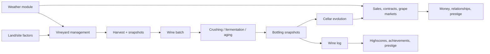
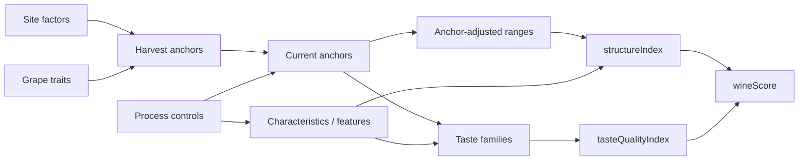
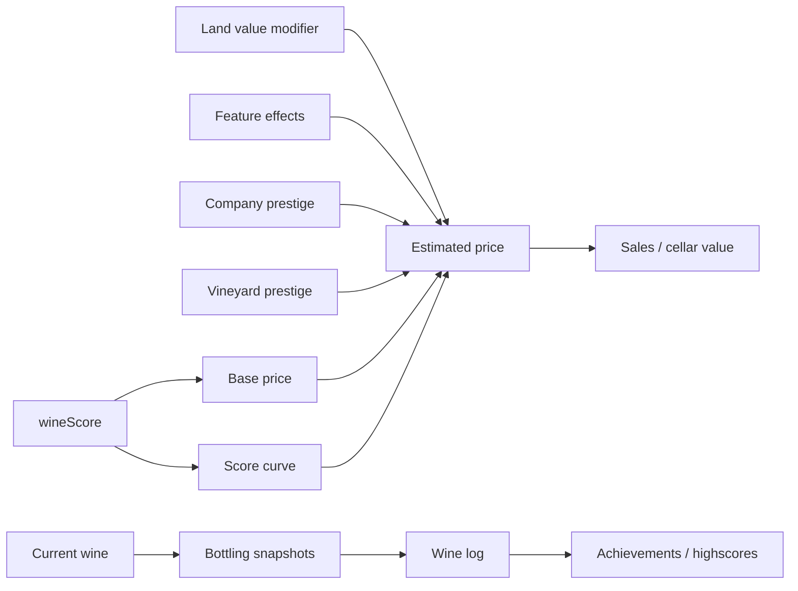
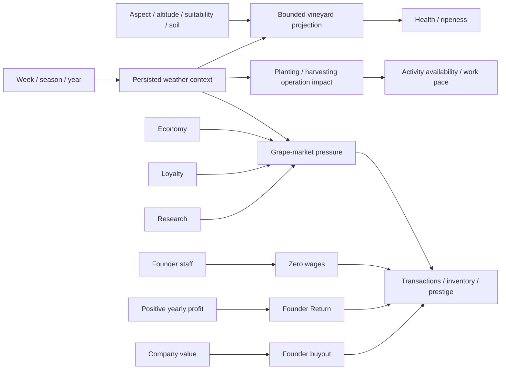

# Wine System Variable Relationship Map

Date: 2026-07-13
Status: Current mainline relationship map

Stable terms and constants live in [CONTEXT.md](../CONTEXT.md). Implementation ownership/status lives in [AIDescriptions_coregame.md](AIdocs/AIDescriptions_coregame.md) and [PROJECT_INFO.md](PROJECT_INFO.md).

## Reading Rules

- Arrows show data dependency, not call order.
- Harvest/bottling/winelog snapshots are immutable; current cellar values may evolve.
- `landValueModifier`, `tasteQualityIndex`, and `structureIndex` are separate signals.

## Main Gameflow

## Variable Groups

| Group | Inputs | Outputs/consumers |
|---|---|---|
| Site factors | Vineyard generation and state | Suitability, land value, harvest anchors, contracts |
| Grape traits | Grape constants | Base characteristics, yield, risk, anchor bias |
| Anchors | Site, grape, process, features | Structure ranges, taste profile, lifecycle risk |
| Structure | Characteristics and anchor-adjusted ranges | `structureIndex`, structure contracts |
| Taste | Anchors, characteristics, color, features, aging | Families, descriptors, `tasteQualityIndex` |
| Lifecycle | Features, oxidation, aging, prestige | Current taste, price, cellar value, risks |
| Weather | Weekly state, forecast, site response | Health/ripeness deltas, market pressure, planting/harvesting availability and work pace, forecast explanations |
| Markets | Wine/grape state, economy, weather, loyalty, research | Orders, contracts, grape prices, Buy Market offers, purchases, revenue |
| Storage vessels | Buy Market cask suppliers, allocation plans, Empty Vessel Maintenance activities | Individually owned cellar assets from rotating supplier offers, with capacity and normalized quality; completing Empty Vessel removes the selected allocation's filled volume and releases only that vessel; future explicit winery/vineyard effect inputs |
| Progression | Sales, scores, assets, research | Prestige, achievements, highscores, gates |

## Invariants

- Site factors and grape traits establish harvest identity; process choices modify it through anchors, characteristics, and features.
- Structure measures physical balance. Taste Quality measures family balance. Neither is land value.
- Weather uses an explicit bounded projection and must not be hidden in wine-score formulas or historical snapshots.
- Weather owns planting/harvesting availability and work pace; Winter blocks starting planting, severe conditions slow work, and extreme conditions can pause it. Clearing's annual availability remains a vineyard-maintenance rule.
- Buy-market previews may simulate implied state/age/features but suppress notifications and prestige events. Storage Vessel purchases create assets and do not alter wine values until a later explicit allocation/effect rule. An Empty Vessel Maintenance activity removes only the selected vessel's filled volume; the batch is deleted only when no volume remains. Cancelling production preserves an active storage plan and its partial batch; cancellation releases only plans that remain reserved and unfilled.
- Static market tuning belongs in `src/lib/constants/`; UI consumes service-prepared models rather than database rows or service-local tuning.
- Research modifies access/scaling or explicit upstream inputs; it does not bypass structure/taste computation.
- Prestige writes use `insertPrestigeEvent()` or `upsertPrestigeEventBySource()` with explicit source and decay metadata.

## Core Subsystems

### Site, Process, Structure, and Taste

### Price and Historical Outputs

### Weather, Markets, and Founder Finance

## Contract and Snapshot Relationships

| Requirement/snapshot | Source | Consumer |
|---|---|---|
| `tasteQuality` | Current `tasteQualityIndex` | Contract validation |
| `structureIndex` | Current structure score | Contract validation |
| `landValue`, origin, altitude, aspect | Vineyard/site | Contract validation and pricing |
| `grape`, `grapeColor` | Batch identity | Contracts, customers, markets |
| Characteristic thresholds/deviation | Current characteristics | Contract validation |
| Harvest snapshots | Site, structure, taste | Batch history and debugging |
| Bottling snapshots | Taste, structure, land value, wine score | Wine Log, highscores, achievements |

## UI Relationship Surfaces

| Surface | Shows |
|---|---|
| Wine modal | Current score/price and snapshot comparison |
| Structure/Taste tabs | Characteristics, ranges, penalties, families, descriptors, quality reasons |
| Land-value/origins tabs | Site factors and source/effect breakdowns |
| Weather Center | Current/next-week weather and vineyard health/ripeness outcomes |
| Planting/harvesting actions | Weather operation status, reason, and current-condition estimate caveat |
| Vineyard weather tooltips | Site summary and aspect/altitude/soil exposure reasons |
| Winepedia Weather | Weather formulas, matrices, bounds, forecast and market derivation |
| Research page | Chain-first progression, gates, permanent effects, project inspector |
| Market modals | Offers, price/limit factors, loyalty, economy/weather context, service-prepared previews |
| Founder Panel | Active founders, returns, buyout action/cost |

## Implementation Checkpoints

| Area | Current rule |
|---|---|
| Anchors | Compact 12-key `WineAnchorValues`; strict database parsing |
| Taste | 14 family profiles; descriptors display-only |
| Score | `wineScore = (tasteQualityIndex + structureIndex) / 2` |
| Snapshots | Bottling values drive historical records and score achievements |
| Weather | Feature facade persists/resolves facts, applies one bounded site-aware projection, and supplies planting/harvesting operation impacts; clearing's annual rule remains outside weather |
| Markets | Sell-side grape trading remains separate; one Buy Market modal hosts registered Grape Procurement and Storage Vessels adapters |
| Research | Gates cover grapes, fermentation, staff/vineyard caps, contracts, and buyer progression; health-decay effect is active |
| Ownership | Founder economy active; board/share runtime remains no-op |

## Alignment Rules

- Keep permanent research effects routed through explicit domain services and keep benefit copy aligned with actual unlocks/effects.
- Update this map and `CONTEXT.md` before descriptors, customer taste matching, severe weather, or board/share systems become player-visible.
- Keep prestige creator inventory and market constants synchronized when adding new sources or tuning.
